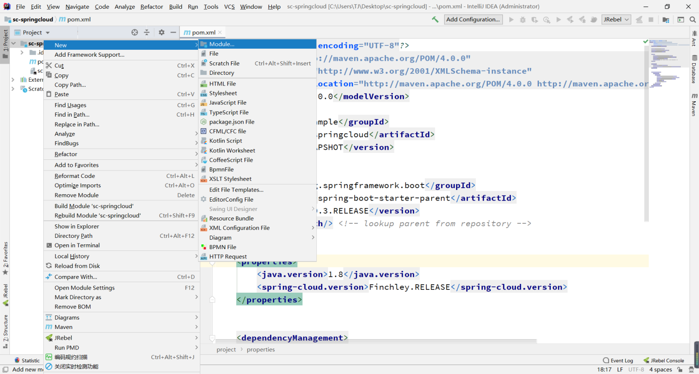

:::tip
二、构建微服务第二步，搭建注册服务
:::

<!-- more -->


### 一、父级目录下构建Springboot项目---->New->Module->Spring Initializr
#### 1.1、新建一个模块

#### 1.2、选择Spring Initializr

#### 1.3、填写相关内容

#### 1.4、点击到最后一步，暂时不进行选择jar

#### 1.5、创建完成后目录结构


### 二、`pom.xml`文件更改，删除无用设置，将父级引用设置为sc-springcloud
#### 
### 
### 三、添加完子模块sc-eureka-server后，进行对父模块sc-springcloud的pom.xml文件设置

```java
 <modules>
        <!--eureka注册服务-->
        <module>sc-eureka-server</module>
        <!--公共模块服务-->
        <module>sc-common</module>
  </modules>

    <dependencies>
       <!-- 全局eureka服务-->
        <dependency>
            <groupId>org.springframework.cloud</groupId>
            <artifactId>spring-cloud-starter-netflix-eureka-server</artifactId>
        </dependency>
        <!-- 全局测试类-->
        <dependency>
            <groupId>org.springframework.boot</groupId>
            <artifactId>spring-boot-starter-test</artifactId>
            <scope>test</scope>
        </dependency>
    </dependencies>
```


### 四、进行sc-eureka-server配置
#### 4.1、pom.xml导入spring-boot-starter-security包，为eureka配置密码(可选)
```java
  <!--为yml文件进行配置账户密码-->
    <properties>
        <eureka.user.name>admin</eureka.user.name>
        <eureka.user.password>admin</eureka.user.password>
    </properties>
    
        
   <dependencies>
        <!--为eureka配置账号密码-->
        <dependency>
            <groupId>org.springframework.boot</groupId>
            <artifactId>spring-boot-starter-security</artifactId>
        </dependency>
    </dependencies>
```
#### 4.2、application.yml配置相关eureka
```java
############################################################
#
# 服务端口配置  约定：8761
#
############################################################
server:
  port: 8761
spring:
  application:
    name: sc-eureka-server
  # 配置相关登录密码
  security:
    user:
      name: @eureka.user.name@
      password: @eureka.user.password@
############################################################
#
# eureka注册地址配置
#
############################################################
eureka:
  instance:
    hostname: localhost
    prefer-ip-address: true
  client:
    #是否注册自己
    register-with-eureka: false
    #获取客户端信息
    fetch-registry: false
    serviceUrl:
      # Eureka注册地址
      defaultZone: http://@eureka.user.name@:@eureka.user.password@@${eureka.instance.hostname}:${server.port}/eureka/

```
#### 4.3、创建config文件，新建WebSecurityConfig类，用来开启认证
```java
package com.springcloud.eureka.config;

import org.springframework.context.annotation.Configuration;
import org.springframework.security.config.annotation.web.builders.HttpSecurity;
import org.springframework.security.config.annotation.web.configuration.EnableWebSecurity;
import org.springframework.security.config.annotation.web.configuration.WebSecurityConfigurerAdapter;

@EnableWebSecurity
@Configuration
public class WebSecurityConfig extends WebSecurityConfigurerAdapter {

    @Override
    protected void configure(HttpSecurity http) throws Exception {
   http.csrf().disable(); //关闭csrf
    http.authorizeRequests().anyRequest().authenticated().and().httpBasic(); //开启认证
    }

}
```
#### 4.4、在EurekaApplication启动类加上注解**@EnableEurekaServer，**开启eureka服务

### 六、配置完成后，启动服务


### 五、访问eureka服务，并输入账户密码admin，admin


### 六、大功告成


