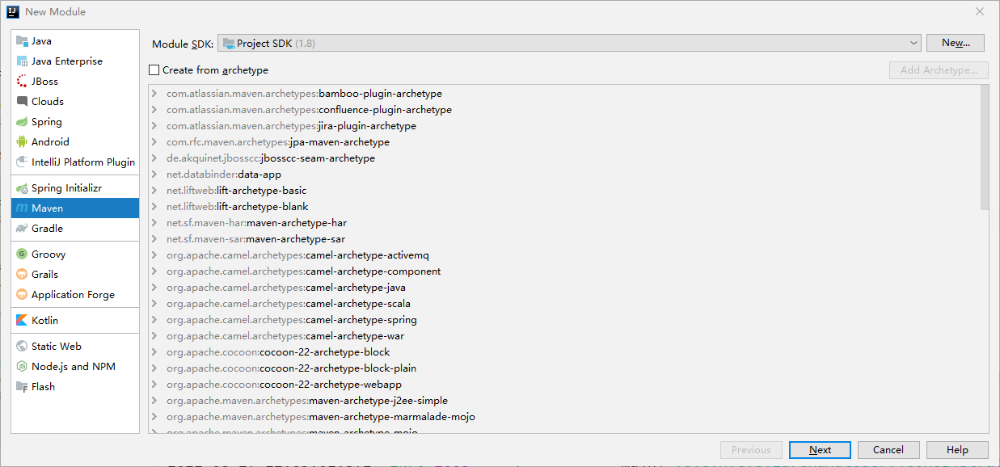
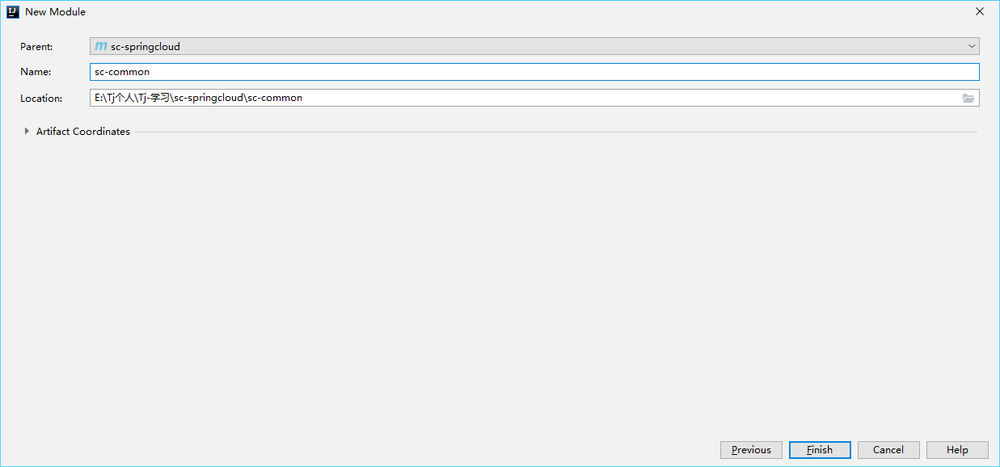

:::tip
三、构建微服务第三步，搭建公共服务
:::

<!-- more -->


### 一、父级目录下构建maven项目---->New->Module->Maven
#### 1.1、新建一个模块

#### 1.2、填写相关内容

#### 1.3、添加完子模块sc-common后，进行对父模块sc-springcloud的pom.xml文件设置模块
```java
<modules>
        <module>sc-common</module>
</modules>
```
#### 1.4、简述
```java
该模块是公共模块，后期各种通用工具包，工具类可进行放入这个包内，其他子服务包需要引入该包
```


### 二、pom.xml事先配置一些公共jar包
```java
<?xml version="1.0" encoding="UTF-8"?>
<project xmlns="http://maven.apache.org/POM/4.0.0"
         xmlns:xsi="http://www.w3.org/2001/XMLSchema-instance"
         xsi:schemaLocation="http://maven.apache.org/POM/4.0.0 http://maven.apache.org/xsd/maven-4.0.0.xsd">
    <parent>
        <artifactId>sc-springcloud</artifactId>
        <groupId>org.example</groupId>
        <version>1.0-SNAPSHOT</version>
    </parent>
    <modelVersion>4.0.0</modelVersion>

    <artifactId>sc-common</artifactId>

    <dependencies>
        <!--lombok-->
        <dependency>
            <groupId>org.projectlombok</groupId>
            <artifactId>lombok</artifactId>
        </dependency>
        <!--jwt-->
        <dependency>
            <groupId>com.auth0</groupId>
            <artifactId>java-jwt</artifactId>
            <version>3.2.0</version>
        </dependency>
        <dependency>
            <groupId>io.jsonwebtoken</groupId>
            <artifactId>jjwt</artifactId>
            <version>0.9.0</version>
        </dependency>
        <!--swagger-->
        <dependency>
            <groupId>io.swagger</groupId>
            <artifactId>swagger-annotations</artifactId>
            <version>1.5.22</version>
        </dependency>
       <!-- hutool-->
        <dependency>
            <groupId>cn.hutool</groupId>
            <artifactId>hutool-all</artifactId>
            <version>4.5.15</version>
        </dependency>

    </dependencies>

</project>
```
### 三、公用实体类和工具类
- rep
   - [ResultDto.java](https://www.yuque.com/attachments/yuque/0/2021/java/21821479/1630048791458-0c778f90-0bf9-4520-9da6-b0f312081b48.java?_lake_card=%7B%22src%22%3A%22https%3A%2F%2Fwww.yuque.com%2Fattachments%2Fyuque%2F0%2F2021%2Fjava%2F21821479%2F1630048791458-0c778f90-0bf9-4520-9da6-b0f312081b48.java%22%2C%22name%22%3A%22ResultDto.java%22%2C%22size%22%3A2313%2C%22type%22%3A%22%22%2C%22ext%22%3A%22java%22%2C%22status%22%3A%22done%22%2C%22taskId%22%3A%22ua47a3edf-a698-4c27-9c64-11765b27655%22%2C%22taskType%22%3A%22upload%22%2C%22id%22%3A%22u92a1fedb%22%2C%22card%22%3A%22file%22%7D)
- util
   - [DateUtil.java](https://www.yuque.com/attachments/yuque/0/2021/java/21821479/1630048800563-2e299347-b9e8-4651-97be-133640960267.java?_lake_card=%7B%22src%22%3A%22https%3A%2F%2Fwww.yuque.com%2Fattachments%2Fyuque%2F0%2F2021%2Fjava%2F21821479%2F1630048800563-2e299347-b9e8-4651-97be-133640960267.java%22%2C%22name%22%3A%22DateUtil.java%22%2C%22size%22%3A3686%2C%22type%22%3A%22%22%2C%22ext%22%3A%22java%22%2C%22status%22%3A%22done%22%2C%22taskId%22%3A%22u577f4020-cbb2-4829-a554-00ceddfffb2%22%2C%22taskType%22%3A%22upload%22%2C%22id%22%3A%22uaf66a446%22%2C%22card%22%3A%22file%22%7D)
   - [JwtUtil.java](https://www.yuque.com/attachments/yuque/0/2021/java/21821479/1630048804764-b72d1aec-2965-4869-9c5f-f83397e66d48.java?_lake_card=%7B%22src%22%3A%22https%3A%2F%2Fwww.yuque.com%2Fattachments%2Fyuque%2F0%2F2021%2Fjava%2F21821479%2F1630048804764-b72d1aec-2965-4869-9c5f-f83397e66d48.java%22%2C%22name%22%3A%22JwtUtil.java%22%2C%22size%22%3A2968%2C%22type%22%3A%22%22%2C%22ext%22%3A%22java%22%2C%22status%22%3A%22done%22%2C%22taskId%22%3A%22u93194ce2-0248-4e85-86a3-1c8861e996b%22%2C%22taskType%22%3A%22upload%22%2C%22id%22%3A%22u9a557cbd%22%2C%22card%22%3A%22file%22%7D)
