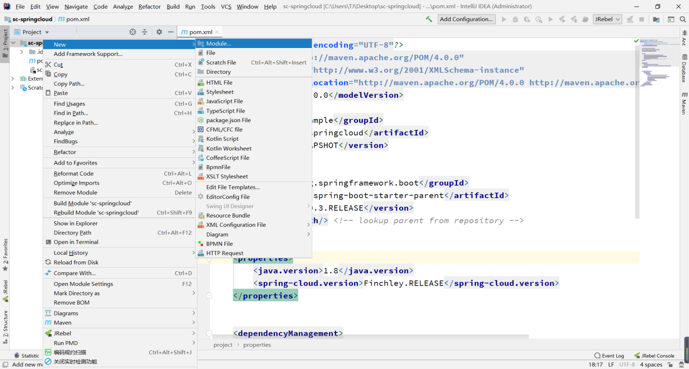
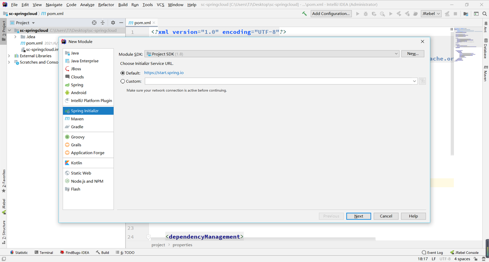
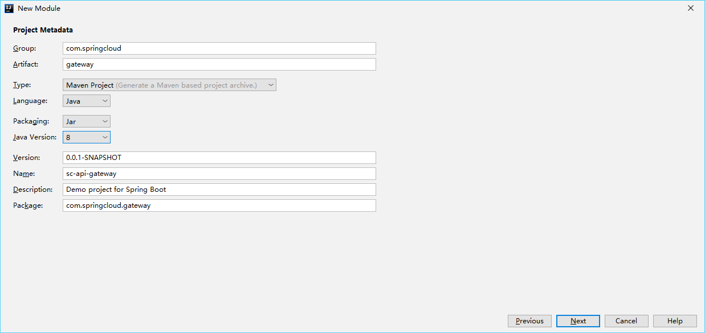
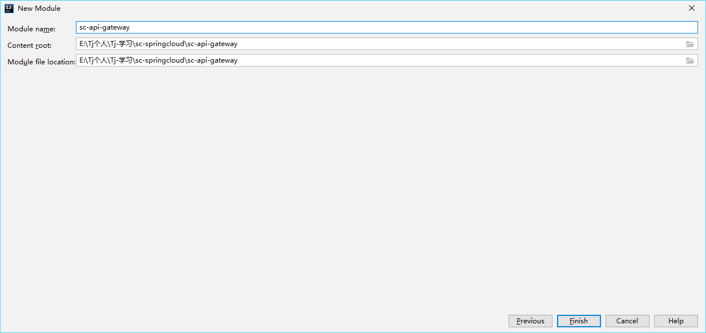
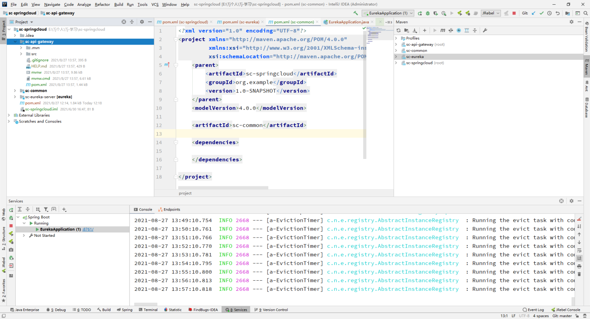
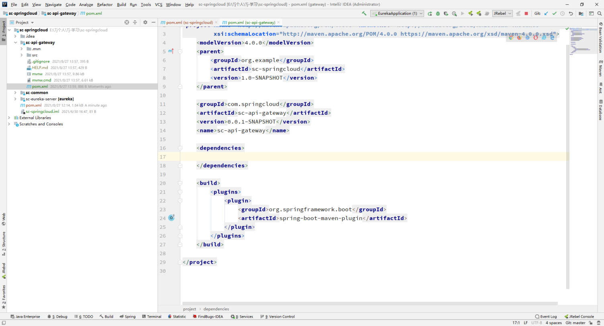
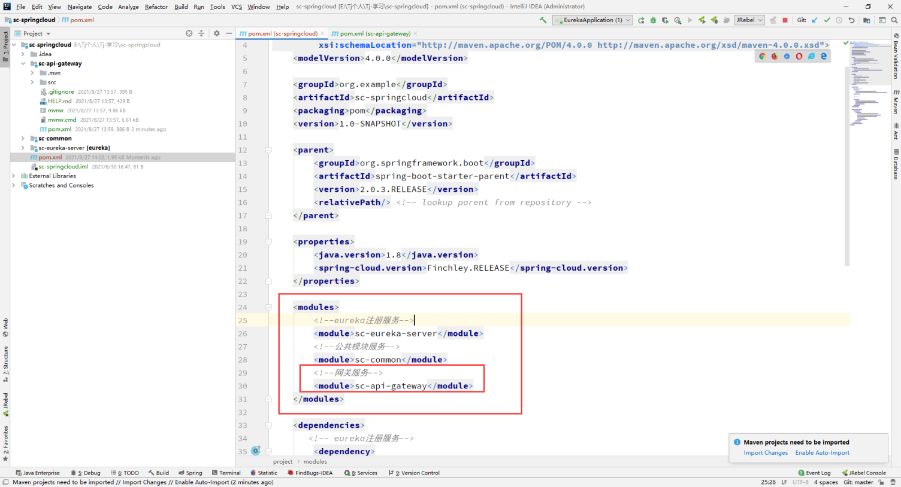
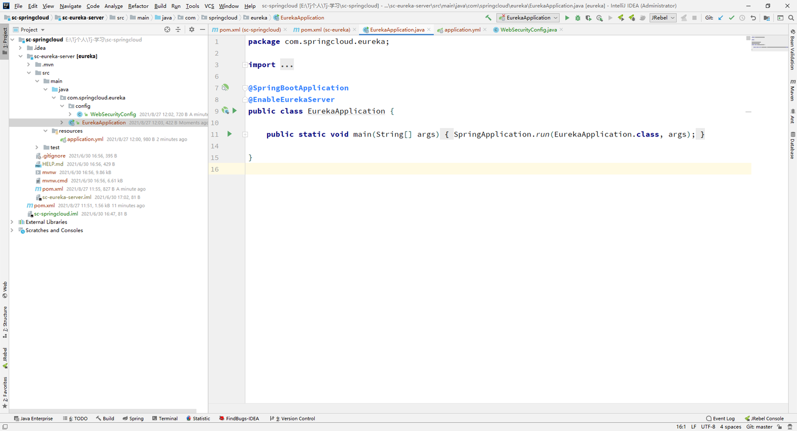
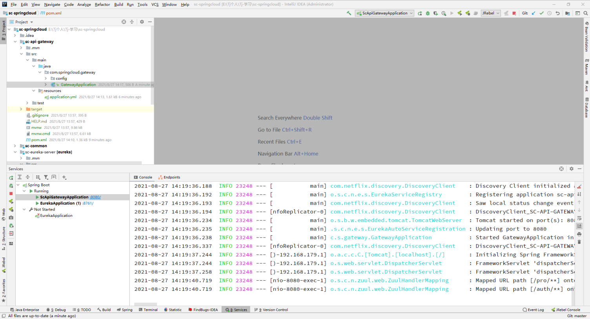
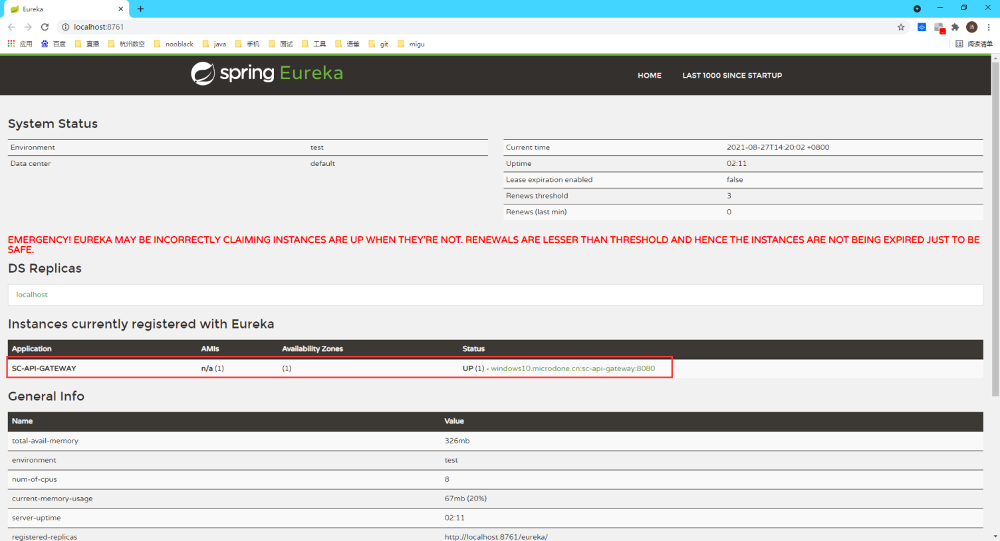

:::tip
四、构建微服务第四步，搭建网关服务
:::

<!-- more -->

### 一、父级目录下构建Springboot项目---->New->Module->Spring Initializr
#### 1.1、新建一个模块

#### 1.2、选择Spring Initializr

#### 1.3、填写相关内容

#### 1.4、点击到最后一步，暂时不进行选择jar

#### 1.5、创建完成后目录结构



### 二、`pom.xml`文件更改，删除无用设置，将父级引用设置为sc-springcloud
#### 
### 
### 三、添加完子模块sc-eureka-server后，进行对父模块sc-springcloud的pom.xml文件设置

```java
 <modules>
        <!--eureka注册服务-->
        <module>sc-eureka-server</module>
        <!--公共模块服务-->
        <module>sc-common</module>
        <!--网关服务-->
        <module>sc-api-gateway</module>
    </modules>
```


### 五、进行sc-api-gateway配置
#### 5.1、pom.xml导入spring-cloud-starter-zuul包，使用zuul作为网关，引入公共模块包
```java

    <dependencies>
        <!-- 公共模块 -->
        <dependency>
            <groupId>org.example</groupId>
            <artifactId>sc-common</artifactId>
            <version>1.0-SNAPSHOT</version>
            <scope>compile</scope>
        </dependency>
        <!-- 服务网关 -->
        <dependency>
            <groupId>org.springframework.cloud</groupId>
            <artifactId>spring-cloud-starter-zuul</artifactId>
            <version>1.4.7.RELEASE</version>
        </dependency>
    </dependencies>
```
#### 5.2、application.yml配置相关zuul
```java
############################################################
#
# 服务端口配置  约定：8761
#
############################################################
server:
  port: 8761
spring:
  application:
    name: sc-eureka-server
  # 配置相关登录密码
  security:
    user:
      name: @eureka.user.name@
      password: @eureka.user.password@
############################################################
#
# eureka注册地址配置
#
############################################################
eureka:
  instance:
    hostname: localhost
    prefer-ip-address: true
  client:
    #是否注册自己
    register-with-eureka: false
    #获取客户端信息
    fetch-registry: false
    serviceUrl:
      # Eureka注册地址
      defaultZone: http://@eureka.user.name@:@eureka.user.password@@${eureka.instance.hostname}:${server.port}/eureka/

```
#### 5.3、创建config文件，新建CorsFilterConfig类，用来配置跨域
```java
package com.springcloud.gateway.config;

import org.springframework.context.annotation.Bean;
import org.springframework.stereotype.Component;
import org.springframework.web.cors.CorsConfiguration;
import org.springframework.web.cors.UrlBasedCorsConfigurationSource;
import org.springframework.web.filter.CorsFilter;

@Component
public class CorsFilterConfig {
    @Bean
    public CorsFilter corsFilter() {
        final UrlBasedCorsConfigurationSource source = new UrlBasedCorsConfigurationSource();
        final CorsConfiguration corsConfiguration = new CorsConfiguration();
        corsConfiguration.addAllowedHeader("*");
        corsConfiguration.addAllowedOrigin("*");
        corsConfiguration.addAllowedMethod("*");
        source.registerCorsConfiguration("/**", corsConfiguration);
        return new CorsFilter(source);
    }
}
```
#### 5.4、在GatewayApplication启动类加上注解**@EnableDiscoveryClient**和**@EnableZuulProxy，**开启zuul服务并注册eureka服务

### 六、配置完成后，启动服务



### 七、访问eureka服务，并输入账户密码admin，admin


### 八、看到sc-api-gateway注册成功便大功告成



### 九、简述
```java
在yml配置的zuul相关路由转发，后续搭建sc-security-auth和sc-provide-server,即可进行路由转发测试
```
